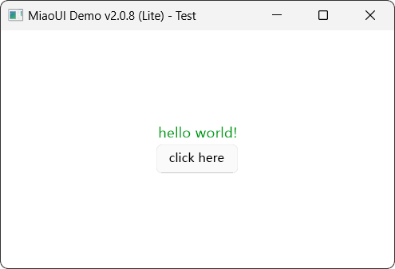

# MiaoUI library
MiaoUI是一套轻量级高性能的跨平台DirectUI渲染引擎库 并用于我们的一些内部项目
> MiaoUI Core 仅用于内部项目 如果你具有访问权限请转到[MiaoUI](https://github.com/Maplespe/MiaoUI)仓库 本页面仅为面向开源项目的MiaoUI Lite页面
## MiaoUI Lite
MiaoUI Lite 是 MiaoUI Core 的精简版 去除了大部分小型项目不常用的功能 并完全开放源代码 可以为小型项目提供快速美观的配置GUI 本项目也可作为一个起始框架来自定义改造

> 部分功能需要在`Mui_Config.h`中启用对应的宏定义

### 功能差异
#### XML语法
MiaoUI使用XML作为中间语言来创建UI
例如
``` xml
<UIControl size="100%,100%" align="Center" bgColor="@hex:ffffff">
  <UIControl autoSize="true" align="LinearV">
    <UILabel fontSize="14" text="hello world!" fontColor="50,150,50,255" />
    <UIButton pos="0,5" text="click here" />
  </UIControl>
</UIControl>
```


> Lite版本完全兼容Core版本的XML控件语法 Core的代码可以直接迁移至Lite 反之亦然 但请注意版本对应 Lite版本从2.0.8开始 兼容Core 2.1.0的语法

 完整的控件属性列表详见`AttribName.txt`和`GeometryXML.txt`文件

 或者直接查看对应控件的头文件 例如 `Mui_Button.h` 所有控件的属性列表都在头文件有注释

#

> 若要从Core版本迁移到Lite版本 部分功能Lite不支持 以下列表列出具体项目

<details>
<summary>平台支持</summary>

| 平台支持 | Core v2.1.0 | Lite v2.0.8 |
| --- | :---: | :---: |
| Windows | 7+ | XP+ |
| Android | 7+ | 
| Linux | X11 GUI |
</details>

<details>
<summary>用户层API</summary>

| 控件 | Core v2.1.0 | Lite v2.0.8 |
| --- | :---: | :---: |
| UIButton | &#10004; | &#10004; |
| UICheckBox | &#10004; | &#10004; |
| UIColorPicker | &#10004; | &#10004; |
| UIComBox | &#10004; | &#10004; |
| UIControl | &#10004; | &#10004; |
| UIEditBox | &#10004; | &#10004; |
| UIEffectLayer | &#10004; |
| UIGroup | &#10004; |
| UIIconBtn | &#10004; |
| UIImgBox | &#10004; | &#10004; |
| UIImgListBox | &#10004; |
| UILabel | &#10004; | &#10004; |
| UIListBox | &#10004; | &#10004; |
| UIMenu | &#10004; |
| UINavBar | &#10004; | Basic |
| UIPanel | &#10004; | &#10004; |
| UIProgress | &#10004; | &#10004; |
| UIScroll | &#10004; | &#10004; |
| UISlider | &#10004; | &#10004; |
| UISwitch | &#10004; |
| UIVideoPlayer | &#10004; |
| UIPage | &#10004; |
| UIDialogPage | &#10004; |
| UITabPage | &#10004; |

| 资源类 | Core v2.1.0 | Lite v2.0.8 |
| --- | :---: | :---: |
| DMResFile V1 | &#10004; | &#10004; |
| DMResFile V2 | &#10004; |

| 其他功能 | Core v2.1.0 | Lite v2.0.8 |
| --- | :---: | :---: |
| SVG图像渲染 | &#10004; |
| 缓动和动画效果 | &#10004; |
| GPU硬件加速 | &#10004; |
| 内存字体加载器 | &#10004; |
| 滤镜效果 | &#10004; |
| 帧缓存和批渲染 | &#10004; |
| EditBox硬件加速 | &#10004; |
| 亮/暗模式默认样式 | &#10004; | 仅亮模式 |
| D3D设备丢失资源重建支持 | &#10004; |
| UIBasicWindow脏区域支持 | | &#10004; |
| 高DPI缩放支持 | &#10004; | &#10004; |

</details>

<details>
<summary>底层API</summary>

| 图形后端 | 适用平台 | Core v2.1.0 | Lite v2.0.8 |
| --- | --- | :---: | :---: |
| GDIPlus 1.0 | Windows | | &#10004;
| Direct2D 1.1/D3D11 | Windows | &#10004; |
| OpenGL Core 3.3 | Windows/Linux | &#10004; |
| OpenGL ES 3.2 | Android | &#10004; |

> GDIPlus渲染器不支持以下接口
> ##### Render:
>   - CreateSVGBitmap
>   - CreateSVGBitmapFromXML
>   - DrawBatchBitmap
>   - DrawBitmapEffects
> ##### Font:
>   - SetFontSize的range参数
>   - SetFontStyle的range参数
>   - SetFontColor的range参数

| 音频后端 | 适用平台 | Core v2.1.0 | Lite v2.0.8 |
| --- | --- | :---: | :---: |
| DirectSound | Windows | &#10004;
| OpenSL ES | Windows | &#10004; |
| PulseAudio | Linux |

| 解码器 | Core v2.1.0 | Lite v2.0.8 |
| --- | :---: | :---: |
| wave | &#10004; |
| mp3 | &#10004; |
| ogg | &#10004; |
| ffmpeg(可选) | &#10004; |
</details>

### 快速开始
#### 先决条件
- Visual Studio 2022
- C++ MSVC v143生成工具
- Windows 10/11 SDK
> Lite版本仅支持Windows 使用Visual Studio进行开发
> 如果要支持Windows XP 你需要改用MSVC v141 WindowsXP工具集
> MiaoUI基于C++17标准编写

你可以转到[Release页面](https://github.com/Maplespe/MiaoUILite/releases)下载已经编译好的库 或者自行编译

**如果要自行编译 请继续阅读以下内容**

克隆本储存库 然后打开`MiaoUI.sln`
此解决方案分为3个项目 按需进行编译
1. MiaoUILite - 项目核心库
2. MiaoUITest - 用于测试的一个项目 可以测试库是否正常运行
3. DmResEditor - DMResFile V1的文件编辑器 如果你打算使用这个文件系统 可以用它编辑dm资源文件

在编译之前 你可以修改MiaoUILite项目下的`Mui_Config.h`文件来控制一些功能的开关

生成并运行MiaoUITest项目这会自动编译MiaoUILite库 生成后的库文件位于`.\MiaoUI\library`目录下

**注意 项目默认是静态链接的 Release:/MT Debug:/MTD**
如果你想使用运行库 可以修改编译选项

#### 开始使用
<details>
<summary>一个简单的demo</summary>

创建一个新的C++项目 并设置好附加库目录到MiaoUI的`library`文件夹
添加MiaoUI的`src\include`目录到附加头文件目录
**无需向编译器添加附加库文件名 mui头文件已经添加了链接指令**

项目必须基于C++17及以上
```cpp
#include "Mui.h"

using namespace Mui;

int APIENTRY wWinMain(HINSTANCE hInstance, HINSTANCE hPrevInstance, LPWSTR lpCmdLine, int nCmdShow)
{
  //注意 MiaoUI支持每个显示器的高DPI缩放 你可以在清单设置 或使用代码告诉系统 DPI由我们自己管理
  //Windows 8+才支持此API 低版本系统无需设置
  SetProcessDpiAwarenessContext(DPI_AWARENESS_CONTEXT_PER_MONITOR_AWARE_V2);

  //设置MiaoUI默认的异常最后处理函数 你也可以自己设置回调 空留为默认
  M_SetLastExceptionNotify();

  //初始化界面库 全局仅有一个MiaoUI类
  MiaoUI engine;
  std::wstring err;
  if (!engine.InitEngine(err))
  {
    MessageBoxW(nullptr, (L"MiaoUI初始化失败! 错误信息: " + err).c_str(), L"error", MB_ICONERROR);
    return 0;
  }

  //创建窗口上下文
  std::wstring title = L"MiaoUI Demo " + std::wstring(Settings::MuiEngineVer) + L" - Test";
  MWindowCtx* windowCtx = engine.CreateWindowCtx(UIRect(0, 0, 452, 328), MiaoUI::MWindowType::Normal, title, true, true);

  //加载默认的UI样式
  windowCtx->XML()->LoadDefaultStyle();

  //绑定全局控件事件回调
  windowCtx->SetEventCallback([](MWindowCtx* ctx, UINotifyEvent event, Ctrl::UIControl* control, _m_param param)
  {
    //你可以通过全局事件回调和MUIEVENT宏来处理控件事件
    //也可以通过绑定对应控件的EventSlot来单独处理
    if (MUIEVENT(Event_Mouse_LDown, L"test_button"))
    {
      MessageBoxW(ctx->Base()->GetWindowHandle<HWND>(), L"hello world!", L"msg", MB_OK);
      return true;
    }
    return false;
  });

  //初始化窗口
  bool result = windowCtx->InitWindow([](MWindowCtx* ctx, Ctrl::UIControl* root, XML::MuiXML* xmlUI)
  {
    //可以通过MXMLCODE宏内联XML代码
    std::wstring_view xml = MXMLCODE(
    <UIControl size="100%,100%" align="Center" bgColor="@hex:ffffff">
      <UIControl autoSize="true" align="LinearV">
        <UILabel fontSize="14" text="hello world!" fontColor="50,150,50,255" />
        <UIButton pos="0,5" text="click here" name="test_button" />
      </UIControl>
    </UIControl>
    );

    return xmlUI->CreateUIFromXML(root, xml.data());
  }, false);
  if(!result)
  {
    MessageBoxW(nullptr, L"初始化窗口失败！XML代码不正确", L"error", MB_ICONERROR);
    return 0;
  }

  //可以访问窗口类设置更多
  auto base = windowCtx->Base();

  base->CenterWindow();
  
  //base->ShowDebugRect(true); //显示控件边界区域 用于调试
  //base->SetRenderMode(true); //启用即时渲染模式 可用于连续画面或者压力测试

  base->ShowWindow(true);

  //base->SetMaxFPSLimit(60); //限制渲染的最大帧率

  //窗口消息循环 直到窗口关闭
  windowCtx->EventLoop();
  return 0;
}
```
</details>

### 依赖
* [pugixml](https://github.com/zeux/pugixml)
* [VC_LTL](https://github.com/Chuyu-Team/VC-LTL5)